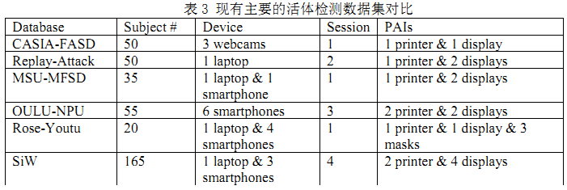
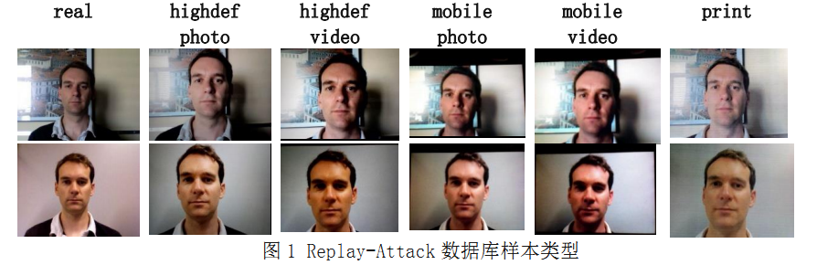
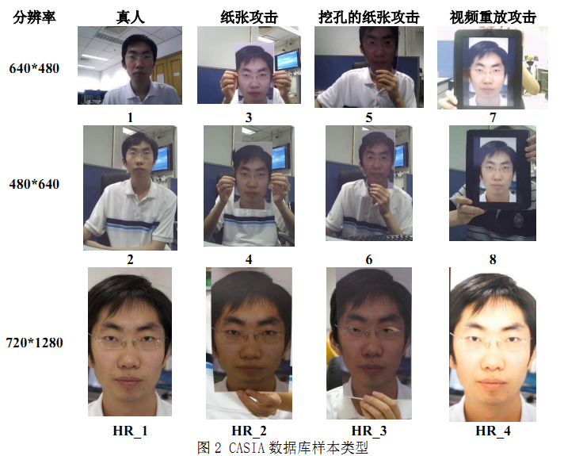
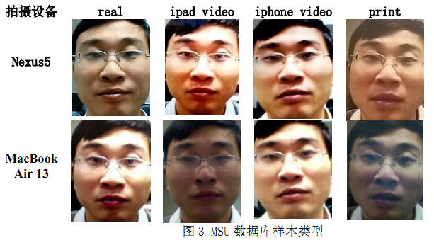
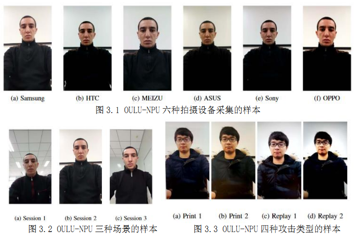
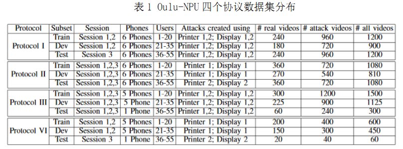
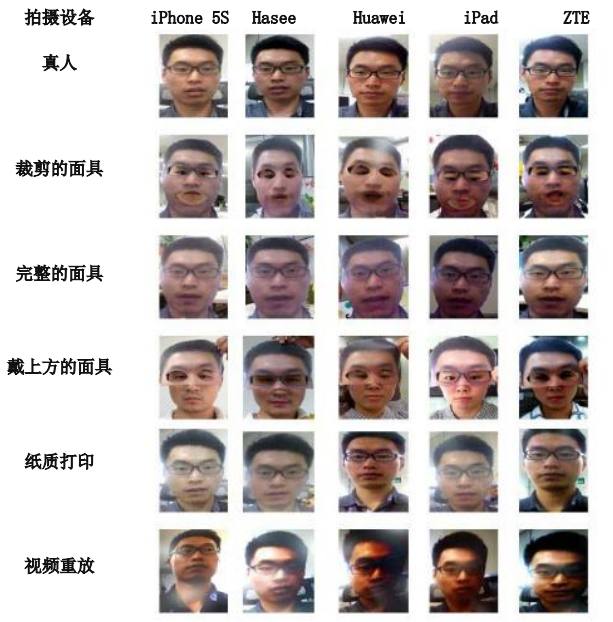
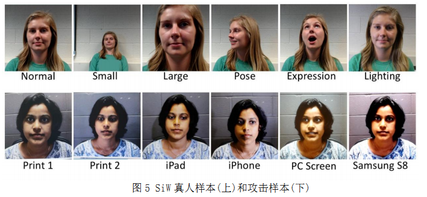
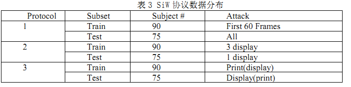
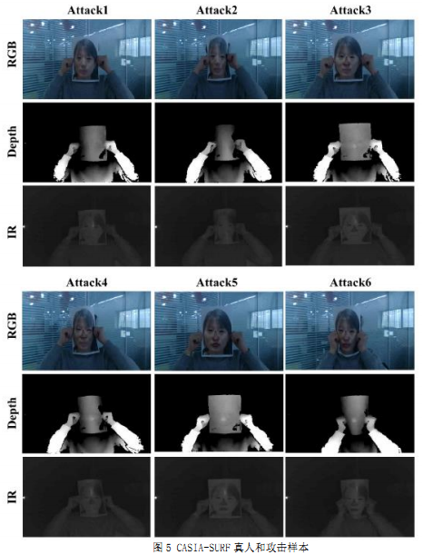

# 人脸反欺骗常用的开源公共数据库
自2012年以来，一些知名研究室发布了公开的人脸反欺骗的数据库，不断在扩充实验人员数、丰富采集方式及设备。
学术界的研究工作使用的人脸反欺骗（又称活体检测）的数据库可以分为在可见光下采集的单模态数据库和多模态的数据库。

## 在可见光下采集单模态活体检测数据库
可见光采集的单模态的数据库，可以总结如下表所示：

### REPLAY—ATTACK数据库
REPLAY—ATTACK数据库[1]是由瑞士的idiap研究所于2012年发布的由1300个视频组成的数据库，包括50实验人员的视频和图片攻击片段。
它的数据集包括训练、验证、测试和注册四个部分，其中训练部分用于训练活体检测分类器，验证部分用于估计阈值，测试部分用于测试算法准确度、注册数据可用于验证检测算法的欺骗敏感度。
在训练、验证和测试组中，包含50个实验人员，各有24段视频共1200段视频（15个做训练集，15个做开发集，20个做测试集）。
24段视频均采用分辨率为320像素（宽）乘240像素（高）的网络摄像头拍摄，包括4段真人，20段攻击视频。

真人视频分别在adverse/controlled两种环境光各拍摄两段视频:

* controlled指的是办公灯已打开，百叶窗朝下，背景均匀;
* adverse指的是背景更复杂，办公室照明灯熄灭。

攻击视频又可分为各有10段攻击视频的两个子集，第一个子集的攻击设备是使用支架固定；第二个子集，攻击者用自己的双手握住用于攻击的设备。
10段视频又包括分别在adverse/controlled两种环境光拍摄的各5段视频：

* 用分辨率为1024×768像素的iPad一代屏幕进行高分辨率的视频/照片的呈现攻击（2段）;
* 用分辨率为480×320像素的iPhone的3GS屏幕进行视频/照片的呈现攻击（2段）;
* 打印在a4 纸上的高分辨率照片的攻击（1段）。

如图1所示，均为手持拍摄，第一列为adverse下拍摄，第二列为controlled下拍摄。

### CASIA 人脸活体检测数据库
CASIA Face Anti-Spoofing 数据库[2]由中国科学院自动化研究所（Institute of Automation,Chinese Academy of Sciences）于2012年发布，采集自50人共600段视频。
包括3种质量的视频序列，由3种不同的摄像头获得。
低质量视频是由经过长时间使用过的USB摄像头采集的，视频中图像大小为640*480。中等质量的是视频是由新买的USB 摄像头采集的，视频中图像大小为480*640。高质量视频是由高分辨率的Sony NEX-5相机采集的。
真实人脸视频的图像分辨率为1280*720。

如图2所示，其中12段视频中，分别采集自12种不同的情形（即3个设备×4种真假情形）:

* 真人采集自1，2，HR_1;
* 纸张攻击采集自3，6，HR_2;
* 挖孔的纸张攻击采集自4，7，HR_3;
* 视频重放攻击采集自5，8，HR_4。

### MFSD(MSU Mobile Face Spoofing Database)数据库 
MFSD[3]由35个对象拍摄的280个视频组成，由美国密歇根州立大学模式识别与图像处理实验室制作，于2015年发布。
如图3所示，每个对象各有8段视频。视频分别由Nexus5手机（720×480）和MacBook Air 13（640×480）的摄像头拍摄。
在这个数据集中有三种欺骗方式：

* 第一种是使用ipad  air屏幕分别播放笔记本摄像头和手机摄像头拍摄的视频。
* 第二种使用iphone 5s屏幕播放同样的视频，分辨率远小于第一种。
* 第三种是使用A3纸拍摄的人脸图片，纸张上的图片用A3纸打印。

### OULU-NPU数据库
OULU-NPU[4]数据库共4950个视频，在2017年由芬兰的奥卢大学和中国的西北工业大学联合建立发布。
数据库包括55个人，由6种手机机型、3种光照环境和背景、两种打印方式和两种重放方式拍摄组成。

如图3.1所示，其中**拍摄设备**包括：

* 具有5 MP前置摄像头的Samsung Galaxy S6 edge；
* 具有13 MP前置摄像头的HTC Desire EYE；
* 具有5 MP前置摄像头的MEIZU X5；
* 具有13 MP前置摄像头的华硕Zenfone SelfieMP；
* 带有13个MP前置摄像头的Sony XPERIA C5 Ultra Dual；
* 带有16个MP旋转摄像头的OPPO N3。

如图3.2所示，三种**光照环境和背景**包括：

* Session 1:在一个开放式办公室中进行，在该办公室中，电子灯被打开，百叶窗朝上，窗户位于用户的后面；
* Session 2:在仅有电子灯的会议室中进行的；
* Session 3:在一个小型办公室中拍摄的，在该办公室中，电子灯已打开，窗户的百叶窗朝上，窗户位于用户面前。

如图3.3所示，攻击方式包括：
* 两种打印攻击，即使用两种不同的打印机CanonimagePRESS C6011（Print 1）和Canon PIXMAiX6550（Print 2）在Canon A3光面纸上打印高分辨率照片；
* 两种视频重放攻击，即高分辨率视频在两个不同的显示设备（1280×1024分辨率的19英寸的DellUltraSharp 1905FP显示器（Replay 1）和分辨率为2560×1600的13英寸Macbook笔记本电脑（Replay 2）上重放。

根据训练测试目标不同，可以分为4个协议：

* 协议I：第一个协议旨在评估人脸PAD方法在不同环境条件下的通用性，即光照和背景场景。由于数据是在三个具有不同照明条件和位置的场景中记录的，因此可以使用从不同场景中获取的视频记录来构建训练，开发和评估集，请参阅表1。
* 协议II：第二种协议旨在通过在测试集中引入以前未见过的PAI来评估PAI变化对面部PAD方法性能的影响。 
* 协议III：人脸反欺骗和图像分类中的关键问题之一通常是跨不同采集设备的泛化。在每个子实验中，使用五个智能手机记录的真实视频和攻击视频来训练和调整对策模型。然后，使用剩余的智能手机录制的视频评估该方法的通用性。
* 协议IV：在最后也是最具挑战性的情况下，将前三个协议组合起来以模拟现实世界的运行条件。更具体地说，在以前看不见的照明条件，背景场景，PAI和输入传感器的情况下，同时评估了面部PAD方法的泛化能力。在所有这些协议中，将55位实验人员分为三个不相交的子集进行训练，开发和测试（

### Rose-Youtu人脸活体检测数据库
Rose-Youtu人脸活体检测数据库由Li等人[5]在2018年发布，
该数据库从25个对象拍摄4225段视频，其中20个对象的3350段视频是公开的。每个拍摄对象都包含有150-200个视频片段，每个片段的平均时长大约是10秒。

数据库使用了5种移动手机：
* Hasee smart-phone (分辨率为640 * 480);
* Huawei Smart-phone (分辨率为640 * 480);
* iPad 4(分辨率为640 * 480);
* iPhone 5s(分辨率为 1280 * 720);
* ZTE smart-phone (分辨率为1280 * 720)。

所有脸部视频都由脸部前方的摄像机拍摄，摄像机与人脸的距离大约是30-50厘米。
数据库里主要包括三种攻击类型：打印攻击、视频重放攻击和面具攻击。

* 在打印攻击中人脸图像被打印到A4纸上；
* 对于视频重放攻击，数据库是在联想LCD屏幕和Mac上播放人脸视频；
* 对于面具攻击，数据库是考虑了带着面具和局部割除两种情况。

此外，为了保证人脸视频是在不同的光照下拍摄的，人脸视频拍摄选择了不同的背景。
为了和真实人脸视频保持一致性，用于播放视频的设备和摄像机之间的距离也保持在30-50厘米之间。
如图4所示，从上到下分别为：真实的面部图像，裁剪蒙版，完整蒙版，上蒙版，纸质打印和视频回放版本。 （对于纸张打印攻击，将同时考虑翘曲纸张和静止纸张的攻击。）
从左至右：iPhone 5S，Hasee手机，Huawei手机，华为手机，iPad和ZTE手机捕获的面部图像。

### Spoof in the Wild (SiW)活体检测数据库
SiW[6]提供来自165个实验人员的真实和欺骗视频。
每个实验人员有8个实时视频和20个欺骗视频，总共4,478个视频。 
所有视频均以30 fps，约15秒的长度和1080P HD分辨率播放。
如图5所示，真人视频分为四个部分，其中包括距离，姿势，照明和表情的变化,共8个视频。
收集的欺骗视频来自多种攻击，例如打印纸和重放。

SiW定义了三种协议： 

* 第一个协议旨在评估不同脸部姿势和表情下脸部PAD方法的一般性。只使用训练集视频的前60帧（主要是正面视图）进行训练，并在所有测试集视频上进行测试。 
* 第二种协议评估在相同欺骗类型的跨媒体上的泛化能力。在此协议中，采用了留一法的策略：在三种重放媒体上进行训练，并在第四种重放媒体上进行测试。每次留下一个不同的媒介，并报告四个分数的平均值和标准偏差。 
* 第三种协议旨在评估未知PA上的性能。基于此数据库设计了从打印攻击到重播攻击（反之亦然）的跨PA测试。 在表3中介绍了每种协议的训练集。

## 多模态活体检测数据库 
### CASIA-SURF
CASIA-SURF[7]包含三个模态的形式（RGB,IR,Depth）。
它包含了1000个不同的人员，拥有21000个视频，其中每个人有一段真人视频及六段不同攻击类型的视频。
数据集的采集是通过采用 Intel RealSense SR300相机在不同的室内背景下采集得到的，同时采集得到 RGB, Depth和InfraRed (IR)视频。
采集的RGB图片分辨率为1280x720，Depth和IR的分辨率为640x480。
其通过A4纸彩印志愿者的人脸并扣去不同的部位得到了6种不同的攻击方式,如图6所示，分别为：

* 将抠除了眼睛的A4纸平铺在脸上；
* 将抠除了眼睛的A4纸弯曲的放在脸上；
* 将抠除了眼睛和鼻子的A4纸平铺在脸上；
* 将抠除了眼睛和鼻子的A4纸弯曲的放在脸上；
* 将抠除了眼睛和鼻子和嘴巴的A4纸平铺在脸上；
* 将抠除了眼睛和鼻子和嘴巴的A4纸弯曲的放在脸上。

## 参考文献：

[1] Chingovska I, Anjos A, Marcel S. On the effectiveness of local binary patterns  in  face anti-spoofing[J]. 2012:1-7. 

[2] Zhang Z, Yan J, Liu S, et al. A face antispoofing database with diverse attacks[C]// Biometrics (ICB), 2012 5th IAPR International Conference onIEEE, 2012:26-31

[3] H.  Li,  S.  Wang,  and  A.  C.  Kot,  “Face  spoofing  detection  with  image quality  regression,”  in 2016  Sixth  International  Conference  on  Image Processing Theory, Tools and Applications (IPTA), pp. 1–6, 2016.

[4] Boulkenafet Z , Komulainen J , Li L , et al. OULU-NPU: A Mobile Face Presentation Attack Database with Real-World Variations[C]// 2017 12th IEEE International Conference on Automatic Face & Gesture Recognition (FG 2017). IEEE Computer Society, 2017.

[5] Haoliang Li, Wen Li, Hong Cao, Shiqi Wang, Feiyue Huang and Alex C. Kot, “Unsupervised Domain Adaptation for Face Anti-Spoofing”, IEEE Transactions on Information Forensics and Security (in press).

[6] Yaojie Liu, Amin Jourabloo, Xiaoming Liu; Learning Deep Models for Face Anti-Spoofing: Binary or Auxiliary Supervision ;Proceedings of the IEEE Conference on Computer Vision and Pattern Recognition (CVPR), 2018, pp. 389-398.

[7] Shifeng Zhang, Xiaobo Wang, Ajian Liu, Chenxu Zhao,Jun Wan, Sergio Escalera, Hailin Shi, Zezheng Wang, andStan Z. Li. A dataset and benchmark for large-scale multi-modal face anti-spoofing.CVPR, 2019.
